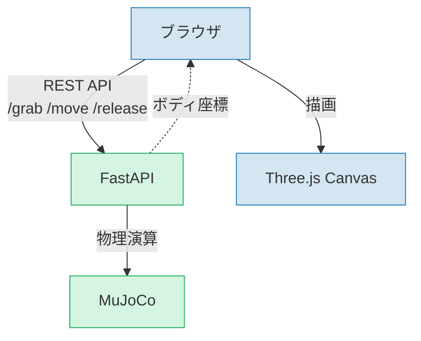

「動画撮れる？」

Three.jsによる物理シミュレーションの可視化を Claude Code に実装してもらった直後、軽い気持ちで聞いてみました。3Dオブジェクトのインタラクティブ操作まで自動でやるとは思っていなかったのですが、結論から言うと、撮れました。失敗2回、方針転換1回、フィードバック3回を経て。

これは動画生成AIの話ではありません。Claude Code がブラウザを起動し、人間が使うのと同じUI画面上で3Dオブジェクトを操作し、その様子を画面録画したものです。

この記事では、そこに至るまでの会話のやりとりをほぼそのまま載せます。「AIに何ができるか」よりも、「人間とAIの間で実際に何が起きるか」を伝えたいからです。

## 何のシミュレーションか

MuJoCo物理エンジンによるケーブルのシミュレーションです。ケーブルの任意の点をマウスでつかんで引っ張ると、物理演算に従って変形し、離すと揺れ戻る。

この会話の直前に、Claude Code がこの可視化画面を新規実装しています（FastAPI + Three.js、70ボディのケーブル、63FPS）。つまり Claude 自身が作った画面を、Claude 自身が操作して録画する、という状況です。

## 試行1: レイキャストでクリック → 失敗

「動画撮れる？」と聞くと、Claude はこんなアプローチを取りました。

1. Playwright（MCP経由）でブラウザを起動
2. シミュレーション開始ボタンをクリック
3. Canvas 上の座標をマウスクリック → ドラッグ

理屈は正しい。人間がブラウザ上でやるのと同じ操作を自動化しようとしたわけです。録画データの取り出しでも試行錯誤しつつ、なんとかwebmファイルを取得しました。

再生してみると——

> 私「**全く動いてなかった**」

クリック判定（Three.jsのレイキャスト）が一度もヒットしておらず、グラブが発動していませんでした。

## 試行2: 座標逆算 → 座標は取れたが…

ここで Claude はこう言いました。

> Claude「ブラウザだとレイキャストで球体に当たらず、グラブが発動しなかったですね。**macOS の画面収録が一番確実です。** Cmd+Shift+5で……」

諦めた。手動で録画してください、と。

でも、3D空間の「どこ」をクリックすべきかが分かれば解決するのでは？ 人間なら見て分かるけど、Claudeには画面が見えていない。

> 私「カメラ情報からスクリーン位置を逆算するのは難しいの？」

> Claude「**全然難しくないです。** Three.js の `Vector3.project(camera)` で3D→スクリーン座標に変換できます」

即答で実装に取りかかり、70ボディ全部のスクリーン座標を取得してみせました。ケーブルの根元が画面の `(218, 172)` にいる、と。外部からアクセスできないES Moduleのスコープも、JSファイルのインターセプトという荒技で突破しています。これでいける、と思いました。

でもクリック→ドラッグしても、結局レイキャストがヒットしない。正確な座標が分かっても、クリック判定が通らなければ意味がない。

## 試行3: API直接呼び出し → 成功

ここで Claude が自分で方針を変えました。

> Claude「**レイキャストではなく API を直接叩いてグラブし、録画だけ Canvas でやります**」

このシミュレーションにはREST APIがあります（`/grab`, `/move`, `/release`）。マウスクリックの代わりにAPIで直接物理エンジンに指示を出し、その結果が描画されるCanvas画面を録画する。ブラウザには人間が使うのと同じUI画面が表示されていて、録画されるのもその画面そのもの。操作の入口だけがマウスからAPIに変わった、という形です。

これで動画が撮れました。

## フィードバック3回

動画は撮れたけど、一発で完成とはいきませんでした。

**1回目**: 「視点が遠い」

ケーブルが画面中央の点にしか見えない。Claude はスクリーンショットで画面を確認しながらカメラをぐっと寄せ、UIパネルも非表示にしました。

**2回目**: 「床下にめり込む」

最初のドラッグで下方向に動かしていたため、ケーブルが床にめり込んでから持ち上がる不自然な動きに。ドラッグ方向を上向きに変更。

**3回目**: 確認OK。

最終成果物は480x360、12.3秒、127KB のMP4。ケーブルの中央を引っ張り上げてアーチ状にし、リリース後の揺れ戻りを見せる。次に枝分かれ部分を引っ張り上げて同じくリリース。

「遠い」「めり込む」という曖昧なフィードバックから、Claude がカメラの寄せ具合やドラッグ方向の具体的な修正を導出しているのが面白いところです。

## Skillとして保存

最後に、この録画手順を Claude Code のプロジェクトSkillとして保存しました。今後は `/record-demo` と打つだけでデモ動画を撮影できます。

Skillには以下のノウハウが詰まっています。

- `page.route()` でES Moduleスコープを突破する方法
- `Vector3.project(camera)` による座標変換
- レイキャストを避けてAPI直接呼び出しにする判断
- VP8 + timeslice指定で録画を安定させるコツ
- Blobをダウンロード経由で保存する方法（base64はサイズが大きすぎて壊れた）

一度やった試行錯誤を、次回は一発で再現できる。これがSkillの価値です。

## 振り返って何に驚いたか

テクニック個々は既存技術の組み合わせです。Playwright でブラウザを操作し、Three.js の API で座標変換し、MediaRecorder で録画する。どれも目新しくない。

驚いたのは、**失敗から自分で方針を変えた**こと。レイキャストが当たらない → 座標逆算を試す → それでもダメ → UIを経由せずAPIを直接叩く。この判断を人間が指示したわけではなく、Claude が自分でたどり着いています。

もう一つは、**3D空間を正しく扱えた**こと。カメラ位置、座標系、投影変換、ドラッグの移動ベクトル。これらを破綻なく組み合わせて、最終的に「見て分かる」動画を出力しました。

人間がやったのは、最初の「動画撮れる？」という依頼と、途中の方向修正（座標逆算の示唆）、そして3回の主観的フィードバック。所要時間は最初の依頼から最終成果物まで約30分。手動で画面収録するよりは長いですが、再利用可能なSkillが副産物として残ったことを考えると、悪くない投資だったと思います。

## 使ったもの

| ツール | 役割 |
|---|---|
| Claude Code (VS Code 拡張) | 全体の実行・判断 |
| Playwright MCP | ブラウザ操作 |
| Three.js | 3D描画 |
| FastAPI | シミュレーションAPI |
| MuJoCo | 物理エンジン |
| ffmpeg | webm → mp4 変換 |
