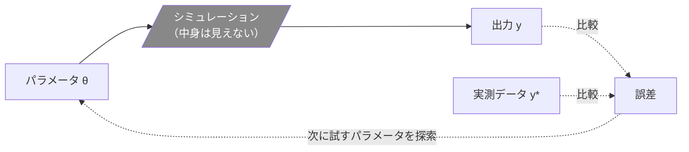
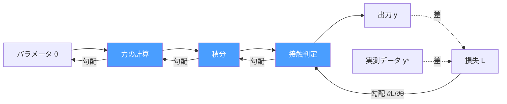

シミュレーションと実機の挙動が合わない。摩擦係数を変えてみる。減衰を調整する。質量をいじる。数パラメータを手で回して、波形を見比べて、「まあこんなものか」で妥協する。

この作業に心当たりがある人は多いと思います。ブラックボックス最適化（遺伝的アルゴリズム、ベイズ最適化など）を使っても、現実的に回せるパラメータはせいぜい数個〜十数個。パラメータ数が増えると探索空間が爆発して、計算が終わらなくなる。

でも実際のシステムには、調整したいパラメータが何十、何百とある。ロボットなら関節ごとの摩擦・減衰・剛性、各リンクの質量と慣性テンソル。機構であれば接触パラメータやばね特性。材料なら弾性係数や粘性。数個に絞って調整するのは「それしかできないから」であって、本当は全部合わせ込みたい。

自動微分を使えば、それができます。パラメータが数百あっても、数万あっても。

## この記事の対象読者

- シミュレーションのパラメータ調整（システム同定、sim-to-real）で苦労している人
- ブラックボックス最適化のパラメータ数の壁にぶつかっている人
- 「微分可能シミュレーション」という言葉を聞いたことはあるけど、自分の仕事と何が関係あるかわからない人

## ブラックボックス最適化の壁

従来のパラメータ最適化は、シミュレーションをブラックボックスとして扱います。

1. パラメータを設定する
2. シミュレーションを回す
3. 出力と実測データの差（目的関数）を計算する
4. パラメータを変えて1に戻る

遺伝的アルゴリズムやベイズ最適化は「次にどのパラメータを試すか」を賢く選びますが、原理的にはこのループの繰り返し。目的関数の値は見えるけど、「各パラメータをどっちにどれだけ動かせば目的関数が下がるか」はわからない。だからパラメータ空間を探索するしかなく、次元が増えると破綻する。

これが「数個が限界」の正体です。

## 自動微分は何が違うのか

自動微分（Automatic Differentiation, AD）を使うと、シミュレーションの内部構造を利用して**すべてのパラメータに対する勾配を一度に計算**できます。

$$
\nabla_\theta L = \left(\frac{\partial L}{\partial \theta_1}, \frac{\partial L}{\partial \theta_2}, \ldots, \frac{\partial L}{\partial \theta_n}\right)
$$

$L$ は目的関数（シミュレーション出力と実測データの差）、$\theta$ は物理パラメータ。この勾配ベクトルが、パラメータ数 $n$ に**ほぼ依存しないコスト**で手に入る。

勾配があれば、「摩擦を少し上げて、減衰を少し下げて、質量はこのまま」という具体的な改善方向がわかる。山の斜面をランダムに歩き回る代わりに、一番急な下り坂の方向が見える。

機械学習でニューラルネットワークの何百万ものパラメータを勾配降下法で最適化できるのは、この仕組みのおかげです。PyTorchやJAXといったフレームワークがこの自動微分を提供していて、同じ原理が物理シミュレーションのパラメータにも使える。

:::message
有限差分法でも勾配は推定できますが、パラメータごとにシミュレーションを1回（中心差分なら2回）やり直す必要があります。パラメータが100個あれば100回（200回）。自動微分なら1回の逆伝播で全部の勾配が出ます。
:::

## 「微分可能シミュレーション」とは

「微分可能シミュレーション」（differentiable simulation）は、シミュレーションの計算過程が自動微分に対応していて、入力パラメータに関する勾配を自動計算できるもの。

何が嬉しいのか、システム同定を例に見てみます。

### 従来のシステム同定



シミュレーションの中でどんな計算が行われたかは関係ない。入力と出力の関係だけを見て、パラメータを探索的に変えていく。

### 微分可能シミュレーションによるシステム同定



シミュレーション内部の各計算ステップを通って、出力から入力まで連鎖律（chain rule）で勾配をたどれる。中身が見えるから、すべてのパラメータに対して「どっちにどれだけ動かせばいいか」がわかる。

この違いは、パラメータが少ないうちは目立ちません。5個のパラメータなら、遺伝的アルゴリズムでも十分収束する。でもパラメータが50個、500個になると、探索ベースのアプローチは現実的な計算時間では収束しなくなります。勾配ベースなら、パラメータ数にほぼ関係なく更新方向が決まる。

## MuJoCo MJXの話——ドキュメントに書かれていない事実

微分可能な物理シミュレーションの具体例として、MuJoCo MJXがあります。MuJoCoの物理演算をJAXで再実装したもので、GPU/TPU上でのバッチシミュレーションに対応。

ここで面白い話があります。**MJXのドキュメントには「微分可能」とほぼ書かれていない。**

[MJXのドキュメント](https://mujoco.readthedocs.io/en/stable/mjx.html)を読むと、書かれているのはインストール方法、`jit`と`vmap`によるバッチ実行、ネイティブMuJoCoとの機能差分、パフォーマンスチューニングの話。`jax.grad`（自動微分）への言及はない。

「MJXは自動微分に対応している」と明示的に書かれている場所は、MJX自身のページではなく[MJWarpのページ](https://mujoco.readthedocs.io/en/latest/mjwarp/)の比較文脈にある一文だけです。

> The dynamics API in MJX is automatically differentiable via JAX.

なぜか。MJXはJAXで書かれているので、JAXの`jax.grad`で自動的に微分できる。JAXの世界では「JAXで書いた関数は微分可能」は当たり前の前提なので、わざわざ書く必要がない——というのが開発側の感覚のようです。

でもJAXに馴染みのない人にとっては、当たり前ではない。MuJoCoのドキュメントを読む人の多くはロボティクスや生体力学のエンジニアで、「JAXで書かれている＝微分可能」という暗黙の前提を共有していない。ドキュメントの構造が、最もこの機能を必要としている人に届きにくい形になっています。

### ネイティブMuJoCoとMJXの微分機能の違い

|  | ネイティブ MuJoCo (C) | MJX (JAX) |
|---|---|---|
| 微分の方式 | 有限差分 | 自動微分 |
| 提供される関数 | `mjd_transitionFD`（状態遷移）、`mjd_inverseFD`（逆動力学） | `jax.grad`で任意の関数を微分可能 |
| パラメータ数のスケーラビリティ | パラメータ数に比例してコスト増 | パラメータ数にほぼ依存しない |
| 典型的な用途 | LQR制御器のA/B行列計算 | 勾配ベースの軌道最適化、システム同定、制御器の学習 |

ネイティブMuJoCoにも`mjd_transitionFD`という微分関数がありますが、これは有限差分です。状態遷移のヤコビアンを効率的に計算する関数で、LQR制御器の設計には十分。ただし「シミュレーション全体を通して任意のパラメータの勾配を取る」という用途には向いていません。

## 何が必要か——JAXの壁

ここまで読んで「使ってみたい」と思った方に、正直な話をします。

MJXで自動微分を使うには、JAXの流儀でコードを書く必要があります。

```python
import jax
import mujoco
from mujoco import mjx

# MuJoCoモデルをMJXに変換
model = mujoco.MjModel.from_xml_path('robot.xml')
mjx_model = mjx.put_model(model)

# シミュレーションを実行する関数
def simulate(params, mjx_model, mjx_data):
    # paramsでモデルのパラメータを更新
    # シミュレーションを数ステップ実行
    # 出力と実測データの差（損失）を返す
    ...
    return loss

# 勾配を計算
grad_fn = jax.grad(simulate)
grads = grad_fn(params, mjx_model, mjx_data)
```

概念としてはシンプルですが、実際に動くコードを書くにはJAX特有の制約（純粋関数、静的な配列サイズ、pytreeの扱い等）を理解する必要がある。MATLABやSimulinkでシステム同定をやってきた人にとっては、かなり遠い世界でしょう。

ただ、JAXのプログラミングモデル自体は数日〜数週間で習得できるレベルで、根本的に難しいわけではありません。ハードルが高く見えるのは「知らないから」であって「難しいから」ではない、という側面が大きい。[JAXの公式チュートリアル](https://docs.jax.dev/en/latest/tutorials.html)は丁寧に書かれていて、NumPyが使える人なら入りやすいはず。

## この先の入り口

MuJoCoには[MJXのチュートリアル](https://mujoco.readthedocs.io/en/stable/mjx.html#tutorial-and-colab-notebooks)が2つ公開されています。どちらもロボットの歩行制御を学習する例で、1つは強化学習（PPO）、もう1つは「differentiable physics tutorial」と題されたもの。後者は`jax.grad`で物理シミュレーションを通して勾配を取りますが、最適化の対象は制御器（ニューラルネットワークの重み）であって、物理パラメータ（摩擦や質量）ではありません。「differentiable」と書いてあってもシステム同定の参考にはならない、という点は注意が必要です。

微分可能シミュレーションはMJXだけのものではありません。NVIDIA Warp、Taichi（DiffTaichi）、Braxなど、複数のフレームワークが存在します。扱う物理（剛体、流体、弾性体）やバックエンド（JAX、CUDA、独自DSL）が異なるので、用途に応じて選ぶことになります。

| ライブラリ | バックエンド | 主な対象 |
|---|---|---|
| MuJoCo MJX | JAX | 剛体・接触・アクチュエータ |
| NVIDIA Warp | CUDA | 剛体・流体・布・パーティクル |
| Taichi / DiffTaichi | 独自 | 弾性体・流体（MPM等） |
| Brax | JAX（MJX含む複数のパイプライン） | 強化学習環境 |

パラメータ調整を「数個を手で回す職人芸」から「全パラメータを勾配で最適化する」に変えられる。技術としてはすでに使える段階にあるのに、それを必要としている人のところにまだ十分届いていない——というのが、MJXのドキュメントを読んで感じたことでした。

## 参考文献

- [MuJoCo MJX ドキュメント](https://mujoco.readthedocs.io/en/stable/mjx.html)
- [MuJoCo Computation > Derivatives](https://mujoco.readthedocs.io/en/stable/computation/index.html) — ネイティブMuJoCoの微分機能
- [MuJoCo MJWarp](https://mujoco.readthedocs.io/en/latest/mjwarp/) — MJXの自動微分に関する唯一の明示的な記述がある
- [JAX 公式チュートリアル](https://docs.jax.dev/en/latest/tutorials.html)
- [The Elements of Differentiable Programming](https://arxiv.org/abs/2403.14606)（[日本語解説](https://www.alphaxiv.org/ja/overview/2403.14606)）— 微分可能プログラミングの包括的教科書
